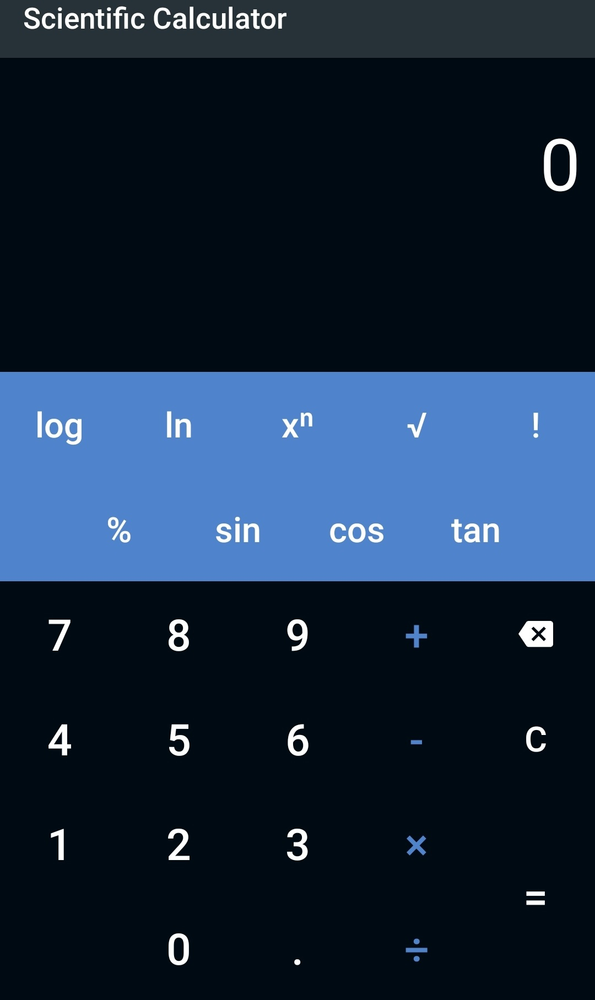

# Android Scientific Calculator

### Functions:
- Addition, Subtraction
- Multiplication, Division
- Trigonometric Functions (Sine, Cosine, Tangent)
- Square Root
- Exponent
- Modulus
- Logarithms (Natural and Base10)

### Screenshot

